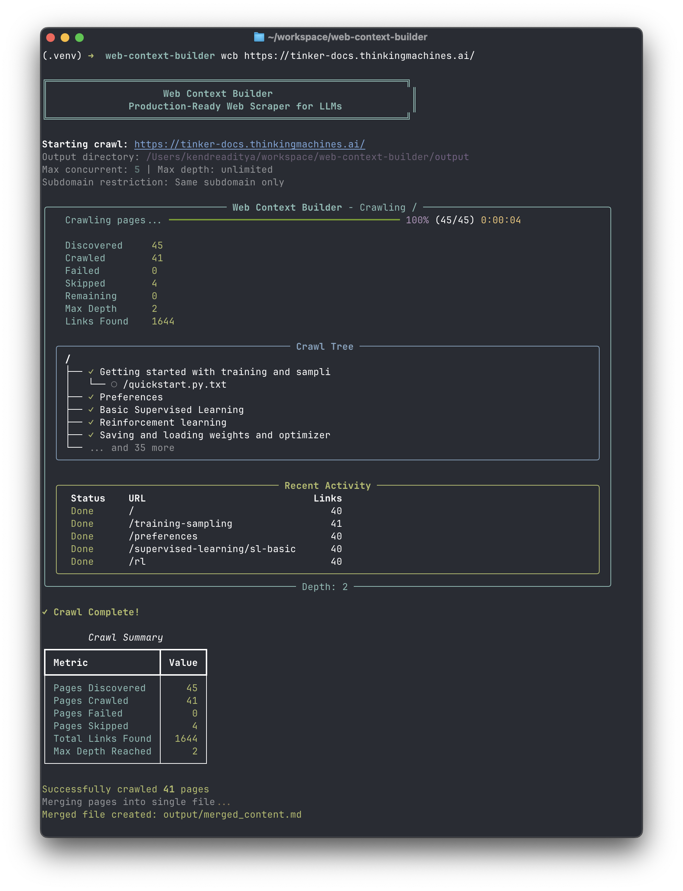

# Web Context Builder

Production-ready async web scraper that converts websites to LLM-optimized markdown.



## Features

- **Fast async crawling** - Uses aiohttp with configurable concurrency (default: 5 concurrent requests)
- **Browser mode** - Optional Playwright support for JavaScript-rendered content
- **Smart filtering** - Only crawls pages on the same domain/subdomain
- **Regex URL filtering** - Include/exclude URLs with custom regex patterns
- **LLM-optimized output** - Strips navigation, footers, ads, and other non-content elements
- **Real-time visualization** - Rich CLI with live progress tree and stats
- **Flexible output** - Individual markdown files per page + single merged file

## Installation

```bash
# Basic installation (static HTML only)
pip install -e .

# With browser support (for JS-rendered sites)
pip install -e ".[browser]"
playwright install chromium
```

## Usage

```bash
# Basic usage
python -m web_context_builder https://docs.example.com

# With options
python -m web_context_builder https://docs.example.com -o ./output -d 3 -c 5

# Crawl across subdomains
python -m web_context_builder https://docs.example.com --cross-subdomain

# For JavaScript-heavy sites (requires browser extra)
python -m web_context_builder https://spa-app.com --browser
```

## CLI Options

| Option | Description | Default |
|--------|-------------|---------|
| `-o, --output` | Output directory | `./output` |
| `-c, --concurrent` | Max concurrent requests | `5` |
| `-d, --depth` | Max crawl depth | unlimited |
| `--delay` | Delay between requests (seconds) | `0.1` |
| `--timeout` | Request timeout (seconds) | `30` |
| `--cross-subdomain` | Allow crawling across subdomains | same subdomain only |
| `-i, --include` | Regex pattern for URLs to include (repeatable) | all URLs |
| `-e, --exclude` | Regex pattern for URLs to exclude (repeatable) | none |
| `--no-progress` | Disable live visualization | enabled |
| `--no-merge` | Skip creating merged file | merge enabled |
| `-m, --merged-name` | Custom merged filename | `<domain>.md` |
| `--browser` | Use headless browser for JS content | disabled |
| `--browser-visible` | Show browser window (for debugging) | headless |

## URL Filtering with Regex

Use `-i/--include` and `-e/--exclude` for fine-grained control over which URLs to crawl:

```bash
# Only crawl URLs containing /api/ or /guide/
python -m web_context_builder https://docs.example.com -i '/api/' -i '/guide/'

# Exclude blog and changelog sections
python -m web_context_builder https://docs.example.com -e '/blog/' -e '/changelog/'

# Combine: only API docs, but exclude deprecated endpoints
python -m web_context_builder https://docs.example.com -i '/api/' -e '/api/v1/' -e '/deprecated/'

# Use full regex power
python -m web_context_builder https://docs.example.com -i '/docs/.*tutorial' -e '\?.*page='
```

**Note:** When include patterns are specified, the domain/subdomain restriction is bypassed - only the regex patterns determine what gets crawled.

## Output

```
output/
├── pages/                    # Individual markdown files
│   ├── index_abc123.md
│   ├── api_def456.md
│   └── ...
└── docs.example.com.md       # All pages merged with TOC
```

## Example

```bash
$ python -m web_context_builder https://tinker-docs.thinkingmachines.ai/ -d 2

╔══════════════════════════════════════════════════════════════╗
║                    Web Context Builder                        ║
║              Production-Ready Web Scraper for LLMs            ║
╚══════════════════════════════════════════════════════════════╝

Starting crawl: https://tinker-docs.thinkingmachines.ai/
Output directory: /path/to/output
Max concurrent: 5 | Max depth: 2
Subdomain restriction: Same subdomain only

╭────────────────────── Web Context Builder ───────────────────────╮
│   Crawling pages... ━━━━━━━━━━━━━━━━━━━━━━━ 100% (41/41) 0:00:04 │
│                                                                  │
│   Discovered     41                                              │
│   Crawled        41                                              │
│   Failed         0                                               │
│   Max Depth      2                                               │
│   Links Found    1644                                            │
╰──────────────────────────────────────────────────────────────────╯

✓ Crawl Complete!
Successfully crawled 41 pages
Merged file created: output/tinker-docs.thinkingmachines.ai.md
```

## Programmatic Usage

```python
import asyncio
from pathlib import Path
from web_context_builder import WebCrawler, CrawlerConfig

async def main():
    config = CrawlerConfig(
        root_url="https://docs.example.com",
        output_dir=Path("./output"),
        max_concurrent=5,
        max_depth=3,
    )

    crawler = WebCrawler(config)
    pages_crawled = await crawler.crawl()
    merged_path = await crawler.merge_results()

    print(f"Crawled {pages_crawled} pages")
    print(f"Merged file: {merged_path}")

asyncio.run(main())
```

## How It Works

1. **Crawl** - BFS traversal starting from root URL using async workers
2. **Filter** - Only follows links on same domain/subdomain
3. **Parse** - Extracts main content, removes nav/footer/ads
4. **Convert** - HTML → clean markdown with preserved code blocks and tables
5. **Save** - Individual files + merged document with table of contents

## License

MIT
